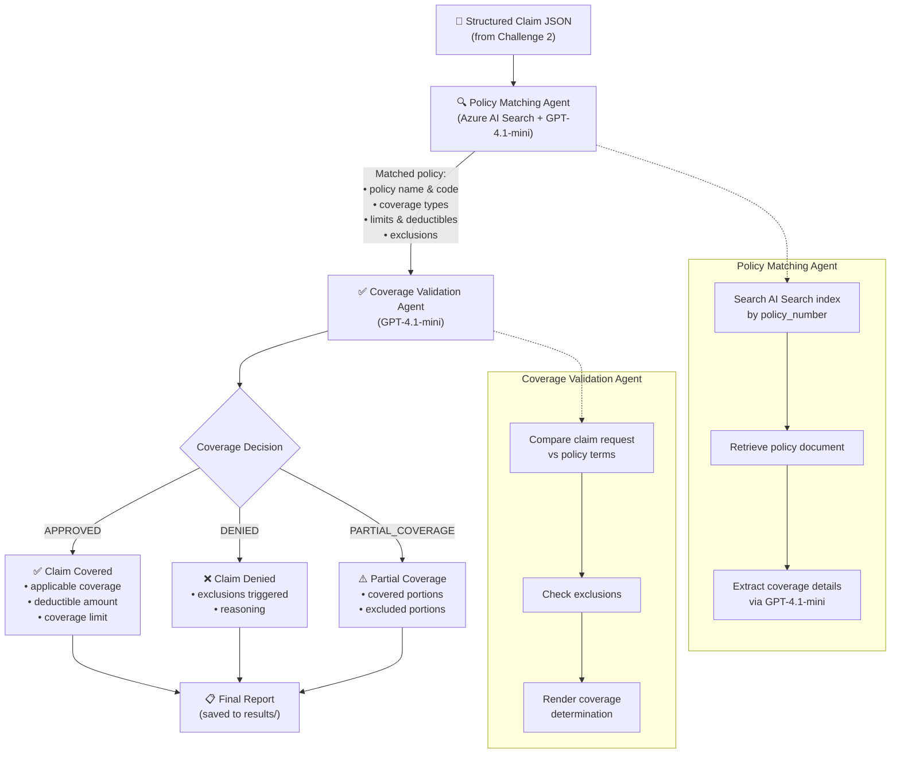

# Challenge 6: Policy Matching & Coverage Validation

**Expected Duration:** 60 minutes

## Overview

In this challenge, you'll build two new AI agents that close a critical gap in the claims processing pipeline: **determining whether a claim is actually covered by the policyholder's insurance policy**. The existing pipeline (Challenges 2-4) extracts structured data from claim images, but never checks that data against the insurer's policy documents. You'll use Azure AI Search (set up in Challenge 1) to retrieve relevant policy documents and an LLM agent to render a coverage determination.

## Why This Matters

Consider the real data in this hackathon:

| Crash | Policy Number | Policy Type | Claim Request |
|-------|--------------|-------------|---------------|
| crash1 | LIAB-AUTO-001 | **Liability Only** | "Full coverage of repair expenses minus deductible" |
| crash2 | COMM-AUTO-001 | Commercial Auto | "Assessment and full coverage for extensive body and structural repairs" |
| crash3 | LIAB-AUTO-001 | **Liability Only** | "Full assessment and repair of all damage" |
| crash4 | COMM-AUTO-001 | Commercial Auto | "Assessment and coverage for all rear-end bodywork and mechanical repairs" |
| crash5 | COMM-AUTO-001 | Commercial Auto | "Full assessment and coverage for all necessary body, mechanical, and suspension repairs" |

Crashes 1 and 3 reference a **liability-only** policy — which explicitly **does not cover damage to the policyholder's own vehicle**. Without a validation step, these claims would be processed and paid incorrectly. Your agents will catch this.

## Architecture

```
┌──────────────────────┐     ┌─────────────────────┐     ┌──────────────────────────┐
│  Structured Claim    │────▶│  Policy Matching     │────▶│  Coverage Validation     │
│  JSON (from Ch. 2)   │     │  Agent               │     │  Agent                   │
│                      │     │  (Azure AI Search +   │     │  (GPT-4.1-mini)          │
│  • policy_number     │     │   GPT-4.1-mini)      │     │                          │
│  • damage_desc       │     │                      │     │  Output:                 │
│  • claim_request     │     │  Output:             │     │  • coverage_decision     │
└──────────────────────┘     │  • matched policy    │     │  • applicable_deductible │
                             │  • coverage types    │     │  • exclusions            │
                             │  • limits & deducts  │     │  • reasoning             │
                             └─────────────────────┘     └──────────────────────────┘
```

## Learning Objectives

By completing this challenge, you will:

- **Use Azure AI Search as an agent tool** to retrieve policy documents using hybrid search (keyword + vector + semantic)
- **Build a policy matching agent** that maps a claim's policy number to the correct insurance policy and extracts relevant coverage details
- **Build a coverage validation agent** that compares claim details against policy terms to determine coverage eligibility
- **Handle real-world edge cases** — claims that request coverage the policy doesn't provide
- **Generate structured coverage determination reports** with clear reasoning

## Prerequisites

- **Challenge 0**: Azure resources deployed (Microsoft Foundry, Azure AI Search)
- **Challenge 1**: Policy documents indexed in Azure AI Search with vectorized embeddings
- **Challenge 2**: OCR and JSON Structuring agents working (produces structured claim data)

---

## Tasks

### Task 1: Review the Policy Matching Agent

The Policy Matching Agent retrieves the correct insurance policy document from Azure AI Search based on the policy number found in the structured claim data.

#### 1.1 Understand the Agent

Open and review [`agents/policy_matching_agent.py`](agents/policy_matching_agent.py):

**Key Components:**
- **Azure AI Search integration**: Uses the search index created in Challenge 1
- **Policy lookup by code**: Searches for the policy document matching the claim's policy number (e.g., `LIAB-AUTO-001`)
- **Coverage extraction**: Returns structured policy details including coverage types, limits, deductibles, and exclusions

**Technology Stack:**
- **Azure AI Search SDK** for hybrid search (keyword + vector + semantic reranking)
- **GPT-4.1-mini** via Azure AI Foundry for summarizing policy coverage into structured format
- **Azure AI Projects SDK** with `PromptAgentDefinition`

#### 1.2 Run the Policy Matching Agent

```bash
cd challenge-6/agents

# Run with a sample structured claim (from Challenge 2 output)
python policy_matching_agent.py ../sample_claims/crash1_structured.json
```

**Expected output:** A JSON object containing:
- The matched policy name and code
- Coverage types (what's covered and what's not)
- Coverage limits and deductible amounts
- Key exclusions relevant to the claim

### Task 2: Review the Coverage Validation Agent

The Coverage Validation Agent takes the structured claim data and matched policy, then determines whether the claim is covered.

#### 2.1 Understand the Agent

Open and review [`agents/coverage_validation_agent.py`](agents/coverage_validation_agent.py):

**Key Components:**
- **Claim-policy comparison**: Analyzes the claim request against policy coverage terms
- **Coverage determination**: Produces APPROVED, DENIED, or PARTIAL_COVERAGE decisions
- **Reasoning generation**: Explains why a claim is or isn't covered with specific policy references
- **Deductible calculation**: Identifies the applicable deductible for approved claims

#### 2.2 Run the Coverage Validation Agent

```bash
cd challenge-6/agents

# Run with a claim that SHOULD be covered (commercial auto + collision)
python coverage_validation_agent.py ../sample_claims/crash2_structured.json

# Run with a claim that should be DENIED (liability-only + own vehicle damage)
python coverage_validation_agent.py ../sample_claims/crash1_structured.json
```

**Expected output for crash2 (APPROVED):**
```json
{
  "coverage_decision": "APPROVED",
  "policy_type": "Commercial Auto Insurance",
  "applicable_coverage": "Collision Coverage - Physical Damage",
  "deductible": "$500",
  "coverage_limit": "$50,000 per incident",
  "reasoning": "The claim involves collision damage during business operations, which is covered under the Commercial Auto policy's Physical Damage - Collision Coverage section.",
  "exclusions_checked": ["Racing", "DUI", "Intentional damage"],
  "exclusions_triggered": []
}
```

**Expected output for crash1 (DENIED):**
```json
{
  "coverage_decision": "DENIED",
  "policy_type": "Liability Only Auto Insurance",
  "applicable_coverage": "None - Own vehicle damage not covered",
  "deductible": "N/A",
  "coverage_limit": "N/A",
  "reasoning": "The policyholder has a Liability Only policy (LIAB-AUTO-001), which explicitly does not cover damage to the policyholder's own vehicle. Section 4.1 states: 'Collision damage to your vehicle' is NOT covered.",
  "exclusions_checked": [],
  "exclusions_triggered": ["Section 4.1 - Own vehicle collision damage excluded"]
}
```

### Task 3: Run the Full Validation Workflow

The validation workflow orchestrates both agents in sequence.

#### 3.1 Review the Workflow

Open [`validation_workflow.py`](validation_workflow.py):



**Pipeline:**
1. Read structured claim JSON (output from Challenge 2)
2. **Policy Matching Agent** → Retrieve and parse the matching policy
3. **Coverage Validation Agent** → Determine coverage based on claim + policy
4. Output a complete coverage determination report

#### 3.2 Run the Workflow on All Claims

```bash
cd challenge-6

# Process a single claim
python validation_workflow.py sample_claims/crash1_structured.json

# Process all sample claims at once
python validation_workflow.py --all
```

#### 3.3 Compare with Ground Truth

Check your results against the expected coverage decisions:

```bash
# Compare agent output against coverage_ground_truth.json
python validation_workflow.py --all --evaluate
```

### Task 4: Integrate with the Existing Pipeline (Bonus)

Extend the Challenge 4 API server to include policy validation as an optional step:

1. Add a `/validate-coverage` endpoint to the FastAPI server
2. Chain it after the `/process-claim` workflow
3. Return the full result: structured claim data + coverage determination

---

## Key Concepts Demonstrated

### Retrieval-Augmented Generation (RAG) for Policy Lookup
The Policy Matching Agent uses Azure AI Search to retrieve relevant policy documents, then uses GPT-4.1-mini to extract and summarize the coverage details. This is a practical RAG pattern — the LLM's response is grounded in the actual policy document, not hallucinated coverage terms.

### Multi-Agent Decision Pipeline
This challenge extends the pipeline from Challenge 2:
```
Image → [OCR Agent] → [JSON Agent] → [Policy Match Agent] → [Coverage Validation Agent] → Decision
```
Each agent has a focused responsibility, making the system modular and testable.

### Business Rule Validation with AI
Rather than hardcoding business rules, the Coverage Validation Agent interprets policy language to make coverage decisions. This approach handles policy variations, edge cases, and natural language claim descriptions without rigid rule sets.

---

## Success Criteria

| Criteria | Description |
|----------|-------------|
| ✅ Policy Matching Agent runs | Agent retrieves correct policy from AI Search given a policy number |
| ✅ Coverage Validation Agent runs | Agent produces a coverage determination with reasoning |
| ✅ Crash 1 & 3 correctly DENIED | Liability-only claims for own vehicle damage are denied |
| ✅ Crash 2, 4 & 5 correctly APPROVED | Commercial auto collision claims are approved |
| ✅ Full workflow executes end-to-end | Both agents orchestrated successfully via `validation_workflow.py` |
| ⭐ Bonus: API integration | Coverage validation available via REST API endpoint |

---

## Tips

- The policy documents were indexed in Challenge 1. If your search isn't returning results, verify your Azure AI Search index name and that the policies were uploaded.
- Use the `policy_number` field from the structured claim data as the primary search key. The policy codes (`LIAB-AUTO-001`, `COMM-AUTO-001`, etc.) appear in the policy document headers.
- The Coverage Validation Agent works best with low temperature (0.1) to ensure consistent, factual determinations.
- Compare your results with [`coverage_ground_truth.json`](coverage_ground_truth.json) to validate accuracy.
